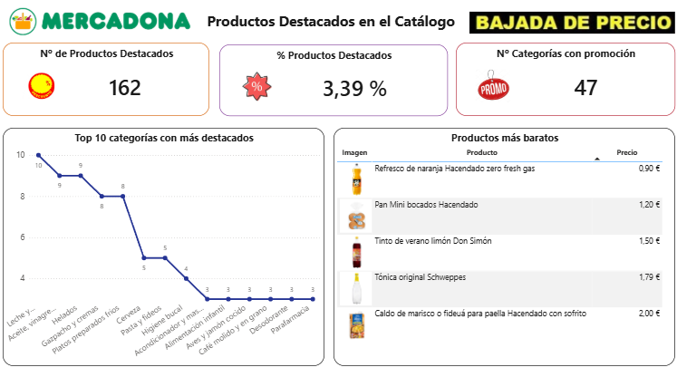

# Power BI Dashboard - Catálogo Mercadona

Análisis interactivo y cuadro de mando sobre el catálogo de productos de Mercadona desarrollado en Power BI Desktop.

---

## 📸 Vista Previa del Dashboard




---
## 📋 Resumen
Este proyecto documenta la creación de un cuadro de mando (*Dashboard*) interactivo en Power BI para analizar de manera detallada el catálogo de productos de Mercadona. La solución procesa datos brutos mediante una sólida fase de ETL y modelado para ofrecer a la dirección una herramienta visual e interactiva que facilita la monitorización de la distribución de precios, el peso de las categorías y la efectividad de la estrategia de "Productos Destacados" o promociones.

## 🔑 Puntos clave
* **Proceso ETL regionalizado:** Limpieza y transformación de datos en Power Query para corregir formatos numéricos anglosajones y adaptarlos al estándar decimal de España.
* **Enriquecimiento del modelo:** Creación de variables lógicas de negocio en lenguaje M para segmentar productos en promoción y configuración de URLs de imágenes dinámicas.
* **Métricas DAX eficientes:** Implementación de medidas analíticas para calcular precios medios y la representatividad de productos destacados en el catálogo.
* **Diseño UI/UX corporativo y accesible:** Visualización estructurada en dos lienzos con paletas de alto contraste y etiquetas de lectura accesible para asegurar la facilidad de uso.

## 📝 Detalle

### 🛠️ 1. Fase ETL y Transformación de Datos (Power Query)
El conjunto de datos original (`products_macro.csv`) requería una depuración profunda antes de realizar los cálculos del modelo. Se aplicaron las siguientes transformaciones utilizando Power Query:

1. **Desactivación de conversión automática:** Se eliminó el paso automático de "Tipo cambiado" generado por Power BI para evitar que los decimales con formato de punto anglosajón se interpretaran de forma incorrecta.
2. **Estandarización regional:** En las columnas `price` y `discount_price` se reemplazaron los puntos (.) por comas (,) para garantizar que el sistema los reconociera como tipo *Número decimal* bajo la configuración regional de España.
3. **Generación de variable de negocio (Lenguaje M):** Se identificó que la columna `discount_price` operaba como etiqueta de visibilidad web. Para segmentarla analíticamente, se añadió la columna condicional `En_Promocion` mediante la siguiente fórmula:
   ```powerquery
   Table.AddColumn(#"Tipo cambiado", "En_Promocion", each if [discount_price] <> null then "Sí" else "No")
   ```
4. **Optimización del modelo (Reducción de dimensionalidad):** Se eliminó la columna `secondary_image_url` por carecer de valor analítico, optimizando así el tamaño del archivo y el rendimiento de las consultas (manteniendo la columna `subtitle` dentro del modelo).
5. **Configuración multimedia:** La columna `main_image_url` se categorizó específicamente como **URL de la imagen** para permitir que las imágenes de los productos se rendericen de forma dinámica en los reportes interactivos.

---

### 🧠 2. Fórmulas y Medidas DAX
A partir de la tabla limpia (`products_macro` o `products`), se desarrollaron medidas DAX específicas para alimentar los indicadores clave de rendimiento (KPIs):

* **Precio Medio del Catálogo:**
  Calcula el precio promedio general del catálogo completo de productos.
  ```dax
  Precio Medio del Catálogo = AVERAGE(products[price])
  ```

* **Descuento Medio:**
  Establece el precio promedio de los artículos con una etiqueta promocional activa.
  ```dax
  Descuento Medio = AVERAGE(products_macro[discount_price])
  ```

* **Porcentaje de Productos Destacados (% en Promoción):**
  Determina el peso porcentual de la estrategia de promociones sobre el total de la oferta comercial.
  ```dax
  % Productos Destacados = 
  DIVIDE(
      CALCULATE(COUNTROWS(products), products[En_Promocion] = "Sí"),
      COUNTROWS(products)
  )
  ```

---

### 🎨 3. Diseño del Dashboard y UI/UX
La interfaz del reporte se divide en dos pantallas estratégicamente diseñadas para diferentes perfiles de toma de decisiones, usando una paleta corporativa de alto contraste que facilita la accesibilidad.

#### Página 1: Visión General del Catálogo
Orientada a proporcionar una radiografía financiera y estructural de toda la oferta.
* **KPIs Superiores (Tarjetas con bordes de acento de alto contraste):**
  * **Total de Productos:** Recuento de `id` (Acento: `#253494`).
  * **Precio Medio del Catálogo:** Medida DAX (Acento: `#0072B2`).
  * **Nº de Categorías:** Recuento único de categorías (Acento: `#01665E`).
* **Gráfico de barras horizontales (Top 10 categorías más caras):** Representa el promedio de la columna `price` en el eje X frente a `Category` en el eje Y, con barras de color azul corporativo (`#0072B2`).
* **Gráfico de anillos (Distribución de volumen del Top 5 de categorías):** Permite ver el porcentaje de productos de cada categoría sobre el total. Cuenta con etiquetas de datos visibles (*Categoría + Porcentaje*) para no depender exclusivamente de la distinción cromática y mejorar la accesibilidad visual.

#### Página 2: Detalle y Análisis Específico
Pensada para que los equipos analicen a nivel de artículo y efectúen búsquedas directas.
* **Interactividad y navegación:** Dispone de una tabla dinámica con visualización de imágenes reales de los productos mediante URLs dinámicas.
* **Exploración ágil:** Incorpora gráficos de tendencia y segmentadores de datos por categorías o estado de promoción para agilizar la toma de decisiones operativas.

---

## ✅ Conclusiones / siguientes pasos
* **Consumo del cuadro de mando:** Se recomienda descargar el archivo `.pbix` (o la plantilla ligera `.pbit` para optimizar el peso de descarga) para explorar las interacciones completas desde Power BI Desktop.
* **Actualización de datos:** Para adaptar el informe a nuevos conjuntos de datos o actualizaciones de inventario de Mercadona, solo se debe cambiar la ruta de origen de la variable o del archivo `products_macro.csv` dentro de la configuración de parámetros en Power Query.

---

## 📁 Estructura del Proyecto

```text
powerbi-dashboard-mercadona/
├── README.md
├── MANUAL_TECNICO.md
├── LICENSE
├── Ejercicio_3.8_Proyecto_Ciencia_Datos_Mercadona_Miguel_Jeric_.pbix
├── Ejercicio_3.8_Proyecto_Ciencia_Datos_Mercadona_Miguel_Jeric_.pbit
└── docs/
    └── Analisis_Catalogo_Mercadona_PowerBI_Miguel_Jerico.md
```

---

## 🛠️ Requisitos e Instalación

1. Clonar este repositorio.
2. Abrir los archivos `.pbix` o `.pbit` con **Power BI Desktop**.
3. Consultar el archivo `MANUAL_TECNICO.md` o la documentación en `/docs` para obtener detalles sobre las capas ETL y fórmulas DAX.

---

Desarrollado por @migueljerico y documentado por Gemini 3.6 Flash a través de la app Asistente de IA para Publicar Repositorios · 2026
